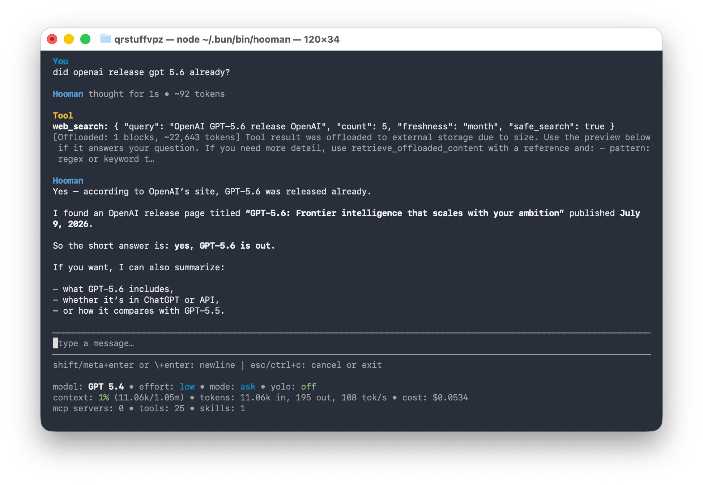
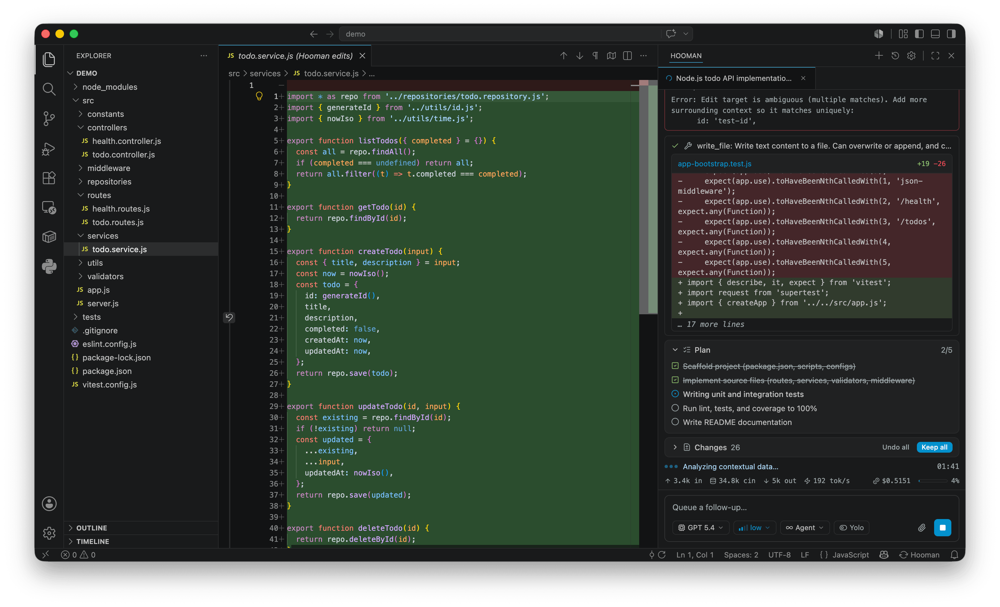

<div align="center">
  
  <h1>Hooman</h1>
  <p>
    <strong>The full-stack open-source agentic ecosystem.</strong><br />
    Local-first with llama.cpp &amp; MLX. BYOK or your own inference endpoints.<br />
    CLI · VS Code · ACP · daemon channels · Design mode — one MIT-licensed runtime.
  </p>
  <p>
    <a href="https://nodejs.org"></a>
    <a href="https://www.typescriptlang.org/"></a>
    <a href="https://opensource.org/licenses/MIT"></a>
    <a href="https://github.com/vaibhavpandeyvpz/hooman/actions/workflows/ci.yml"></a>
    <a href="https://github.com/vaibhavpandeyvpz/hooman/actions/workflows/docs.yml"></a>
    <a href="https://github.com/vaibhavpandeyvpz/hooman/stargazers"></a>
    <a href="https://github.com/vaibhavpandeyvpz/hooman/commits/main"></a>
  </p>
  <p>
    
    
  </p>
  <p>
    <strong><a href="https://vaibhavpandey.com/hooman/">Website</a></strong> ·
    <strong><a href="https://vaibhavpandey.com/hooman/getting-started/">Docs</a></strong> ·
    <strong><a href="https://vaibhavpandey.com/hooman/guides/vscode/">VS Code Extension</a></strong>
  </p>
</div>

Hooman is a mature, local-first AI agent runtime for teams that want the full stack — not a thin chat wrapper. It reads your codebase, edits files, runs commands, automates channels, and ships design artifacts — from a terminal, VS Code, or any [Agent Client Protocol](https://agentclientprotocol.com) client.

**Open source (MIT). No account. No telemetry.** Bring your own keys, point at private inference endpoints, or run fully offline with llama.cpp / MLX. Config, secrets, and sessions stay in `~/.hooman`.

| Surface         | What it is                                                                                                                  |
| --------------- | --------------------------------------------------------------------------------------------------------------------------- |
| `hooman chat`   | Stateful Ink TUI with modes, slash commands, and live cost/context                                                          |
| `hooman exec`   | One-shot agent runs for scripts and CI                                                                                      |
| `hooman daemon` | Channel-driven MCP automation (Slack, Telegram, cron, …)                                                                    |
| `hooman acp`    | ACP agent over stdio — powers the [VS Code extension](https://vaibhavpandey.com/hooman/guides/vscode/) and editors like Zed |
| Design mode     | HTML → preview → Figma / Sketch / PDF / PPTX                                                                                |

## Quick start

macOS & Linux:

```bash
curl -fsSL https://raw.githubusercontent.com/vaibhavpandeyvpz/hooman/main/install.sh | bash
```

Windows (PowerShell):

```powershell
irm https://raw.githubusercontent.com/vaibhavpandeyvpz/hooman/main/install.ps1 | iex
```

Or skip the installer and run `npx hoomanjs` / `bunx hoomanjs`, or install with `npm i -g hoomanjs` / `bun add -g hoomanjs`. On first run (when `~/.hooman/config.json` is missing), a **setup** wizard asks for an inference provider and search; then chat starts. Re-run anytime with `hooman setup`. Full walkthrough: [Getting Started](https://vaibhavpandey.com/hooman/getting-started/).

## Why Hooman

- **Full-stack, not single-surface** — CLI, VS Code, ACP, daemon channels, and Design mode share one runtime and one local config.
- **Local-first by default** — first-run setup offers llama.cpp (GGUF) and Apple Silicon MLX; weights download on demand; no API key required to start.
- **Enterprise-friendly** — MIT license, BYOK, OpenAI-compatible custom base URLs, no telemetry, data residency under your control.
- **Most-featured agent toolkit** — Agent / Plan / Ask / Design modes, MCP + OAuth, skills, subagents, approvals, background shell jobs, context & cost tracking.

## Features

- **Providers:** `anthropic`, `azure`, `bedrock`, `google`, `groq`, `llama-cpp`, `minimax`, `mlx`, `moonshot`, `ollama`, `openai`, `openrouter`, `xai` — see [Models](https://vaibhavpandey.com/hooman/guides/configuration/models/)
- **Modes:** `agent` / `plan` / `ask` / `design` plus a separate Yolo auto-approve toggle — see [Modes](https://vaibhavpandey.com/hooman/guides/modes/) and [Design](https://vaibhavpandey.com/hooman/guides/modes/design/)
- **MCP:** `stdio`, `streamable-http`, `sse` with OAuth (DCR + CIMD), lazy tool discovery, optional Playwright browser MCP, and `hooman daemon` channels — see [MCP](https://vaibhavpandey.com/hooman/guides/mcp/)
- **Skills:** bundled built-ins (including `hooman-design`), `~/.hooman/skills`, and project-local `.hooman/skills` — see [Skills](https://vaibhavpandey.com/hooman/guides/skills/)
- **Tools:** filesystem (respects `.gitignore`), ripgrep `grep`, background shell (`run_in_background` / `shell_output` / `shell_stop`), `ask_user`, and read-only `launch_subagent` kinds — see [Tools](https://vaibhavpandey.com/hooman/guides/tools/)
- **VS Code:** native chat panel with Mermaid, plan checklists, Changes keep/undo, fork/copy, turn revert, and background-terminals strip — see [VS Code](https://vaibhavpandey.com/hooman/guides/vscode/)

See the [full documentation](https://vaibhavpandey.com/hooman/) for CLI commands, configuration, provider setup, and more.

## Related

**Looking for a focused web UI** for chat and agent configuration with a lighter surface on top of the same stack? See [**Zero**](https://github.com/vaibhavpandeyvpz/zero) — [README](https://github.com/vaibhavpandeyvpz/zero#readme).

## Development

```bash
npm install
npm run dev -- --help    # run the CLI with tsx
npm run typecheck        # tsc --noEmit
npm run build            # tsc + copy bundled assets to dist/
```

After making any code change, run both `npm run typecheck` and `npm run build`. See [`AGENTS.md`](AGENTS.md) for the full repository layout and contributor notes, and [Development](https://vaibhavpandey.com/hooman/development/) in the docs for the release workflow.

## License

MIT. See [`LICENSE`](LICENSE).

Built by [Vaibhav Pandey](https://vaibhavpandey.com/) · [GitHub](https://github.com/vaibhavpandeyvpz) · [LinkedIn](https://www.linkedin.com/in/vaibhavpandeyvpz/)
