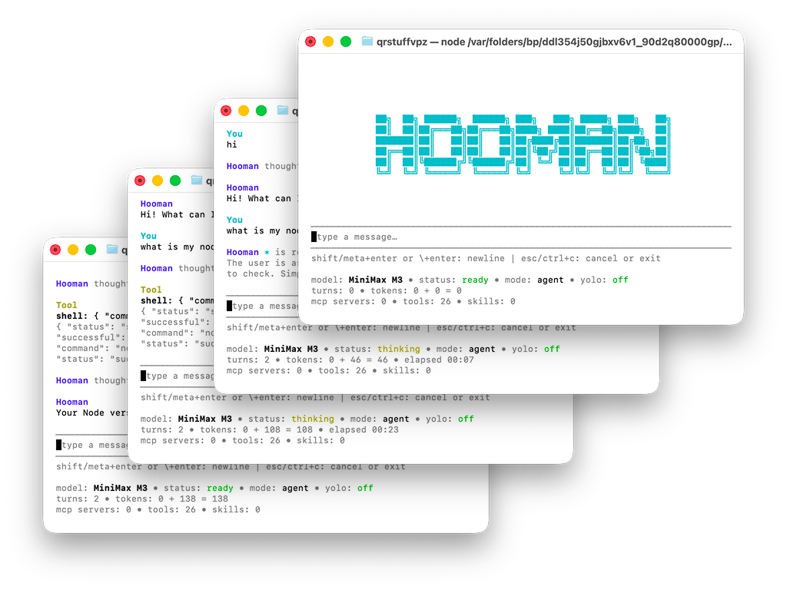

<div align="center">
  <h1>Hooman</h1>
  <p>
    Hooman is a hackable, Bun-powered AI agent toolkit for local workflows. It is built with TypeScript, <a href="https://www.npmjs.com/package/@strands-agents/sdk">Strands Agents SDK</a>, and <a href="https://github.com/vadimdemedes/ink">Ink</a>.
  </p>
  <p>
    <a href="https://bun.com"></a>
    <a href="https://www.typescriptlang.org/"></a>
    <a href="https://github.com/vadimdemedes/ink"></a>
    <a href="https://github.com/vaibhavpandeyvpz/hooman/actions/workflows/build-publish.yml"></a>
    <a href="https://github.com/vaibhavpandeyvpz/hooman/stargazers"></a>
    <a href="https://github.com/vaibhavpandeyvpz/hooman/commits/main"></a>
  </p>
  <p>
    
  </p>
</div>

It gives you a practical toolkit to build and run agent workflows:

- a one-shot `exec` command for single prompts
- a stateful `chat` interface for iterative sessions
- a `daemon` command for channel-driven MCP automation
- an Ink-powered `configure` workflow for app config, prompts, MCP servers, and installed skills
- an `acp` command for running Hooman as an Agent Client Protocol (ACP) agent over stdio

## Features

- Multiple LLM providers: `ollama`, `openai`, `anthropic`, `google`, `bedrock`, `groq`, `moonshot`, `xai`
- Local configuration under `./.hooman` when that folder exists in the current working directory, otherwise `~/.hooman`
- Optional web search tool with provider selection (`brave` or `tavily`)
- MCP server support via `stdio`, `streamable-http`, and `sse`
- MCP server `instructions` support: server-provided instructions are appended to the agent system prompt
- MCP channel notification support through `hooman daemon --channels`
- Skill discovery / install / removal through the integrated configure flow
- Bundled prompt harness toggles (`behaviour`, `communication`, `execution`, `engineering`, `guardrails`)
- Built-in subagent runner tools (`research`, `plan`) with configurable concurrency
- Toolkit-oriented architecture with configurable tools, prompts, memory, and transports
- Interactive terminal UI for chat and configuration

## Requirements

- [Bun](https://bun.com) `>= 1.0.0`
- Node/npm available if you want to install skills from the public skills catalog
- Provider credentials or local model runtime depending on the LLM you choose

## Usage

Fastest way to get started without cloning the repo:

```bash
bunx hoomanjs configure
bunx hoomanjs chat

# or install globally
bun i -g hoomanjs
```

Or with npm:

```bash
npx hoomanjs configure
npx hoomanjs chat

# or install globally
npm i -g hoomanjs
```

Recommended first run:

1. Run `hooman configure` to choose your LLM provider and model.
2. Start chatting with `hooman chat`.
3. Use `hooman exec "your prompt"` for one-off tasks.

## Must have

For the best experience, set up both:

1. **MCP servers** for on-demand tools in `chat` / `exec` (task APIs, messaging, schedulers, etc.).
2. **MCP channels** for event-driven automation with `hooman daemon --channels` (notifications become agent prompts).

Suggested MCP servers from this ecosystem:

- [`cronmcp`](https://github.com/vaibhavpandeyvpz/cronmcp) - lets Hooman schedule recurring prompts and automations, so routine checks and follow-ups run on time.
- [`jiraxmcp`](https://github.com/vaibhavpandeyvpz/jiraxmcp) - gives Hooman direct Jira Cloud access to search issues, update tickets, and help drive sprint workflows.
- [`slackxmcp`](https://github.com/vaibhavpandeyvpz/slackxmcp) - connects Hooman to Slack so it can read channel context, draft updates, and post actions where your team already works.
- [`tgfmcp`](https://github.com/vaibhavpandeyvpz/tgfmcp) - enables Telegram bot workflows, making it easy to route notifications and respond from agent-driven chats.
- [`wappmcp`](https://github.com/vaibhavpandeyvpz/wappmcp) - brings WhatsApp Web messaging into Hooman for customer or team communication automations.

For production deployments, still review permissions and use least-privilege credentials/tokens for each integration.

## Install

```bash
bun install
```

Run locally:

```bash
bun run src/cli.ts --help
```

Or use the dev alias:

```bash
bun run dev -- --help
```

Link the CLI locally:

```bash
bun link
hooman --help
```

## Commands

### `hooman exec`

Run a single prompt once.

```bash
hooman exec "Summarize the current repository"
```

Use a specific session id:

```bash
hooman exec "What changed?" --session my-session
```

Skip interactive tool approval (allows every tool call; use only when you trust the prompt and environment):

```bash
hooman exec "Summarize this repo" --yolo
```

### `hooman chat`

Start an interactive stateful chat session.

```bash
hooman chat
```

Optional initial prompt:

```bash
hooman chat "Help me plan the next task"
```

Resume or pin a session id:

```bash
hooman chat --session my-session
```

Skip the in-chat tool approval UI (same semantics as `exec --yolo`):

```bash
hooman chat --yolo
```

### `hooman daemon`

Run a long-lived daemon that subscribes to MCP servers advertising the fixed `hooman/channel` capability and feeds each received notification into the agent as a queued prompt.

```bash
hooman daemon --channels
```

Resume or pin a session id:

```bash
hooman daemon --session my-daemon --channels
```

Skip remote channel permission relay and allow every tool call from daemon turns (same risk profile as `exec` / `chat` with `--yolo`):

```bash
hooman daemon --channels --yolo
```

### Feature Flags

Runtime tool and prompt switches are controlled from `config.json`:

- `search.enabled`
- `search.provider` (`brave` or `tavily`)
- `search.brave.apiKey`
- `search.tavily.apiKey`
- `prompts.behaviour`
- `prompts.communication`
- `prompts.execution`
- `prompts.engineering`
- `prompts.guardrails`
- `tools.todo.enabled`
- `tools.fetch.enabled`
- `tools.filesystem.enabled`
- `tools.shell.enabled`
- `tools.sleep.enabled`
- `tools.ltm.enabled`
- `tools.wiki.enabled`
- `tools.mcp.enabled` (enables MCP management tools + prefixed MCP server tools/instructions)
- `tools.skills.enabled` (enables skills management tools + skills prompt sections)
- `tools.agents.enabled` (enables built-in `run_agents` tool)
- `tools.agents.concurrency`

Both `ltm` and `wiki` include dedicated Chroma settings under:

- `tools.ltm.chroma` (default collection: `memory`)
- `tools.wiki.chroma` (default collection: `wiki`)

### `hooman configure`

Open the Ink configuration workflow.

```bash
hooman configure
```

The configure UI currently lets you:

- edit app configuration values
- choose search provider and set its API key
- toggle bundled harness prompts (`behaviour`, `communication`, `execution`, `engineering`, `guardrails`)
- edit `instructions.md` in your `$VISUAL` / `$EDITOR` (cross-platform fallback included)
- add, edit, and delete MCP servers with confirmation
- search, install, refresh, and remove skills

### `hooman acp`

Run Hooman as an Agent Client Protocol (ACP) agent over stdio.

```bash
hooman acp
```

ACP notes:

- ACP sessions are stored under the active Hooman data directory in `acp-sessions/`
- ACP loads MCP servers passed on `session/new` and `session/load`, in addition to Hooman's local `mcp.json`
- ACP `session/new` and `session/load` support `_meta.userId` and `_meta.systemPrompt`
- when `_meta.systemPrompt` is provided, it is appended to the agent system prompt with a section break

## Configuration Layout

Hooman stores its data in:

```text
./.hooman/   # when this folder exists in the current working directory
~/.hooman/   # otherwise
```

Important files and folders:

- `config.json` - app name, LLM provider/model, tool flags, LTM/wiki settings, compaction
- `instructions.md` - system instructions used to build the agent prompt
- `mcp.json` - MCP server definitions
- `skills/` - installed skills
- `sessions/` - persisted session data
- `acp-sessions/` - persisted ACP session metadata and message snapshots

## Example `config.json`

This is the config shape loaded by Hooman:

```json
{
  "name": "Hooman",
  "llm": {
    "provider": "ollama",
    "model": "gemma4:e4b",
    "params": {}
  },
  "search": {
    "enabled": false,
    "provider": "brave",
    "brave": {},
    "tavily": {}
  },
  "prompts": {
    "behaviour": true,
    "communication": true,
    "execution": true,
    "engineering": false,
    "guardrails": true
  },
  "tools": {
    "todo": {
      "enabled": true
    },
    "fetch": {
      "enabled": true
    },
    "filesystem": {
      "enabled": true
    },
    "shell": {
      "enabled": true
    },
    "sleep": {
      "enabled": true
    },
    "ltm": {
      "enabled": false,
      "chroma": {
        "url": "http://127.0.0.1:8000",
        "collection": {
          "memory": "memory"
        }
      }
    },
    "wiki": {
      "enabled": false,
      "chroma": {
        "url": "http://127.0.0.1:8000",
        "collection": {
          "wiki": "wiki"
        }
      }
    },
    "mcp": {
      "enabled": false
    },
    "skills": {
      "enabled": false
    },
    "agents": {
      "enabled": true,
      "concurrency": 3
    }
  },
  "compaction": {
    "ratio": 0.75,
    "keep": 5
  }
}
```

Tool approvals are session-scoped and are not persisted in `config.json`.

Supported `llm.provider` values:

- `ollama`
- `openai`
- `anthropic`
- `google`
- `bedrock`
- `groq`
- `moonshot`
- `xai`

Supported `search.provider` values:

- `brave`
- `tavily`

## Provider Notes

### Ollama

Good default for local usage. Example:

```json
{
  "provider": "ollama",
  "model": "gemma4:e4b",
  "params": {}
}
```

### OpenAI

Example:

```json
{
  "provider": "openai",
  "model": "gpt-5",
  "params": {
    "apiKey": "..."
  }
}
```

### Anthropic

Provider-specific settings such as `apiKey`, `authToken`, `baseURL`, and `headers` are supported. Other values are forwarded into the model config.

```json
{
  "provider": "anthropic",
  "model": "claude-sonnet-4-20250514",
  "params": {
    "apiKey": "...",
    "temperature": 0.7
  }
}
```

### Google

Uses Strands `GoogleModel` on top of `@google/genai`. Top-level options like `apiKey`, `client`, `clientConfig`, and `builtInTools` are supported; other values go into Google generation params.

```json
{
  "provider": "google",
  "model": "gemini-2.5-flash",
  "params": {
    "apiKey": "...",
    "temperature": 0.7,
    "maxOutputTokens": 2048,
    "topP": 0.9,
    "topK": 40
  }
}
```

### Bedrock

Supports `region`, `clientConfig`, and optional `apiKey`, with all other values forwarded as Bedrock model options.

```json
{
  "provider": "bedrock",
  "model": "anthropic.claude-sonnet-4-20250514-v1:0",
  "params": {
    "region": "us-east-1",
    "clientConfig": {
      "profile": "dev",
      "maxAttempts": 3,
      "credentials": {
        "accessKeyId": "AKIA...",
        "secretAccessKey": "...",
        "sessionToken": "..."
      }
    },
    "temperature": 0.7,
    "maxTokens": 1024
  }
}
```

You can also rely on the AWS default credential chain (recommended) by setting environment variables such as `AWS_ACCESS_KEY_ID`, `AWS_SECRET_ACCESS_KEY`, and optionally `AWS_SESSION_TOKEN`.

### Groq

Uses the Vercel AI SDK Groq provider (`@ai-sdk/groq`) on top of Strands `VercelModel`. Provider-specific settings `apiKey`, `baseURL`, and `headers` are picked up; other values are forwarded into the model config (`temperature`, `maxTokens`, etc.). Defaults to `GROQ_API_KEY` from the environment when no `apiKey` is supplied.

```json
{
  "provider": "groq",
  "model": "gemma2-9b-it",
  "params": {
    "apiKey": "...",
    "temperature": 0.7
  }
}
```

### Moonshot

Uses the Vercel AI SDK Moonshot provider (`@ai-sdk/moonshotai`) on top of Strands `VercelModel`. Provider-specific settings `apiKey`, `baseURL`, `headers`, and `fetch` are picked up; other values are forwarded into the model config (`temperature`, `maxTokens`, `providerOptions`, etc.). Defaults to `MOONSHOT_API_KEY` from the environment when no `apiKey` is supplied. Moonshot reasoning models such as `kimi-k2-thinking` can be configured through `params.providerOptions.moonshotai`.

```json
{
  "provider": "moonshot",
  "model": "kimi-k2.5",
  "params": {
    "apiKey": "...",
    "temperature": 0.7
  }
}
```

### xAI

Uses the Vercel AI SDK xAI provider (`@ai-sdk/xai`) on top of Strands `VercelModel`. Provider-specific settings `apiKey`, `baseURL`, and `headers` are picked up; other values are forwarded into the model config (`temperature`, `maxTokens`, etc.). Defaults to `XAI_API_KEY` from the environment when no `apiKey` is supplied.

```json
{
  "provider": "xai",
  "model": "grok-4.20-non-reasoning",
  "params": {
    "apiKey": "...",
    "temperature": 0.7
  }
}
```

## MCP Configuration

`mcp.json` is stored as:

```json
{
  "mcpServers": {}
}
```

### Example stdio server

```json
{
  "mcpServers": {
    "filesystem": {
      "type": "stdio",
      "command": "npx",
      "args": ["-y", "@modelcontextprotocol/server-filesystem", "/tmp"],
      "env": {
        "EXAMPLE": "1"
      },
      "cwd": "/tmp"
    }
  }
}
```

### Example streamable HTTP server

```json
{
  "mcpServers": {
    "remote": {
      "type": "streamable-http",
      "url": "https://example.com/mcp",
      "headers": {
        "Authorization": "Bearer token"
      }
    }
  }
}
```

### Example SSE server

```json
{
  "mcpServers": {
    "legacy": {
      "type": "sse",
      "url": "https://example.com/sse",
      "headers": {
        "Authorization": "Bearer token"
      }
    }
  }
}
```

## MCP Notes

- MCP server `instructions` from the protocol `initialize` response are appended to Hooman's system prompt, after local `instructions.md` and session-specific prompt overrides.
- Hooman reads these instructions automatically from connected MCP servers when building the agent.
- `hooman daemon --channels` subscribes to MCP servers that advertise the experimental `hooman/channel` capability.
- Hooman also reads `hooman/user`, `hooman/session`, and `hooman/thread` capability paths so daemon turns preserve origin metadata from the source channel.
- When a matching notification is received, Hooman uses `params.content` as the prompt if it is a string; otherwise it JSON-stringifies the notification params and sends that to the agent.
- Daemon mode processes notifications sequentially and reuses the same agent session over time.
- Tool calls from daemon turns are no longer blanket auto-approved: if the originating MCP server supports `hooman/channel/permission`, Hooman relays a remote approval request back to that source; otherwise the tool call is denied.
- `exec`, `chat`, and `daemon` accept `--yolo` to bypass those approval paths and allow all tools without prompting or relay.

## Skills

Skills are installed under:

```text
./.hooman/skills   # when ./.hooman exists
~/.hooman/skills   # otherwise
```

The configure workflow can:

- search the public skills catalog
- install a skill from a source string, repo, URL, or local path
- refresh installed skills
- remove installed skills with confirmation

## Development

Install dependencies:

```bash
bun install
```

Run the CLI:

```bash
bun run src/cli.ts --help
```

Run typecheck:

```bash
bunx tsc --noEmit
```

## License

MIT. See `LICENSE`.
